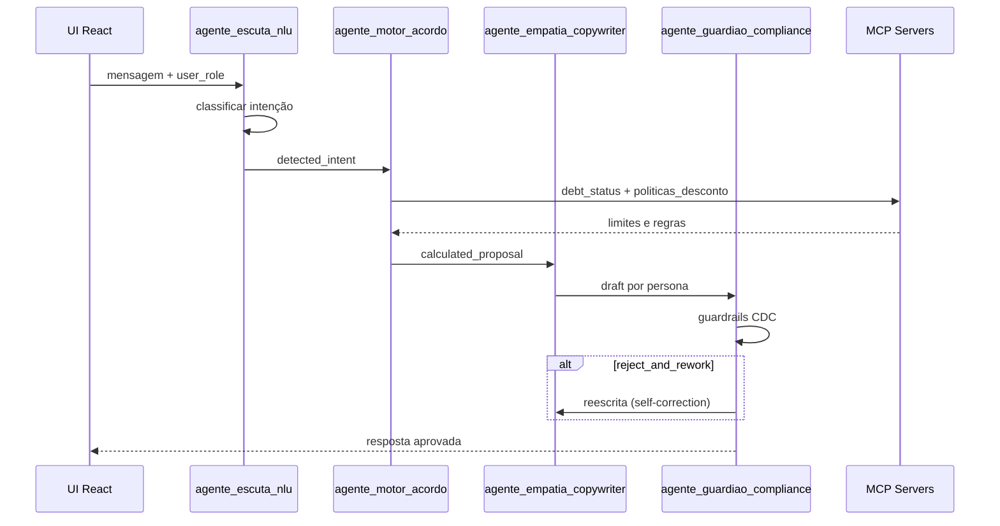

# Arquitetura — POC Multiagente de Cobrança

Este repositório contém o código-fonte da interface e as especificações arquiteturais para a orquestração de múltiplos agentes de IA no contexto de recuperação de crédito.

## Estrutura do Repositório

```
poc-collection-agents/
├── docs/          # Documentação (Arquitetura, PRD, Requisitos)
├── config/        # Harness YAML (System Prompts, Tools, MCPs)
├── src/           # Interface React (Vite)
├── public/        # Assets estáticos
└── index.html
```

## Visão Geral

```
┌──────────────────────────────────────────────────────────────────┐
│  Adapters (fase 2)                                                │
│  WhatsApp / CRM ➔ Schema Unificado de Mensagens                 │
├──────────────────────────────────────────────────────────────────┤
│  UI (React/Vite) — src/App.jsx                                    │
│  Chat dual-persona │ Inspetor IA │ Grafo de agentes │ Logs      │
├──────────────────────────────────────────────────────────────────┤
│  Core — State Graph / LangGraph (fase 1)                          │
│  Escuta NLU ➔ Motor Acordo ➔ Empatia ➔ Guardião Compliance     │
├──────────────────────────────────────────────────────────────────┤
│  Harness + MCP + RAG                                              │
│  config/harness_negotiator.yaml                                   │
└──────────────────────────────────────────────────────────────────┘
```

## Camadas

### 1. Adapters

Converte mensagens do WhatsApp/CRM para o schema unificado. O parâmetro `user_role` (`CUSTOMER` | `AGENT`) guia o pipeline sem duplicar lógica.

**Estado atual:** mock local na UI.

### 2. Core (State Graph)

Orquestrador LangGraph com 4 agentes definidos no harness:

| Agente | ID | Model | MCP / Tools |
|--------|-----|-------|-------------|
| Escuta Ativa | `agente_escuta_nlu` | gpt-4o-mini | NLU, sentimento |
| Motor de Acordo | `agente_motor_acordo` | gpt-4o | `mcp:crm:debt_status`, `mcp:vector-store:politicas_desconto`, `calculate_amortization` |
| Empatia | `agente_empatia_copywriter` | gpt-4o-mini | Persona por `user_role` |
| Guardião | `agente_guardiao_compliance` | gpt-4o | `mcp:vector-store:cdc_guidelines`, guardrails regex |

**Estado atual:** pipeline simulado no frontend com delays e keyword matching.

### 3. Harness e RAG

Arquivo `config/harness_negotiator.yaml` define:

- System prompts por agente
- MCP servers (URNs)
- Tools disponíveis
- Guardrails (`strict_regex_block` → `reject_and_rework`)
- Campos do state graph

### 4. Isolamento de Dados (MCP)

O LLM **nunca acessa BD diretamente**. Dados de dívida e políticas chegam via MCP:

- `urn:mcp:crm:debt_status` — saldo, atraso, limites
- `urn:mcp:vector-store:politicas_desconto` — tabelas de alçada
- `urn:mcp:vector-store:cdc_guidelines` — regras CDC

## State Graph

```json
{
  "session_id": "string",
  "user_role": "CUSTOMER | AGENT",
  "detected_intent": "string",
  "calculated_proposal": "object | null",
  "compliance_status": "APROVADO | REJEITADO | null"
}
```

### Fluxo



## Stack

| Camada | Tecnologia |
|--------|------------|
| UI | React 18, Vite 6, Tailwind 3, Lucide |
| Config | YAML (`harness_negotiator.yaml`) |
| Orquestrador (fase 1) | LangGraph |
| Dados | MCP (sem acesso direto à BD) |
| Deploy | Vercel |

## Como testar localmente

```bash
cd poc-collection-agents
npm install
npm run dev
```

Abra a URL exibida pelo Vite (tipicamente `http://localhost:5173`).

## Deploy na Vercel

1. Faça push deste código para um repositório no GitHub.
2. Aceda ao dashboard da Vercel e clique em **Add New Project**.
3. Importe o repositório do GitHub.
4. Defina **Root Directory** como `poc-collection-agents` (se o repo for monorepo).
5. A Vercel detetará automaticamente Vite/React. Clique em **Deploy**.

## Próximos Passos

1. Extrair pipeline simulado de `App.jsx` para serviço LangGraph
2. Carregar `harness_negotiator.yaml` no orquestrador
3. Implementar MCP servers (`debt_status`, `politicas_desconto`, `cdc_guidelines`)
4. Substituir keyword matching por NLU/LLM real
