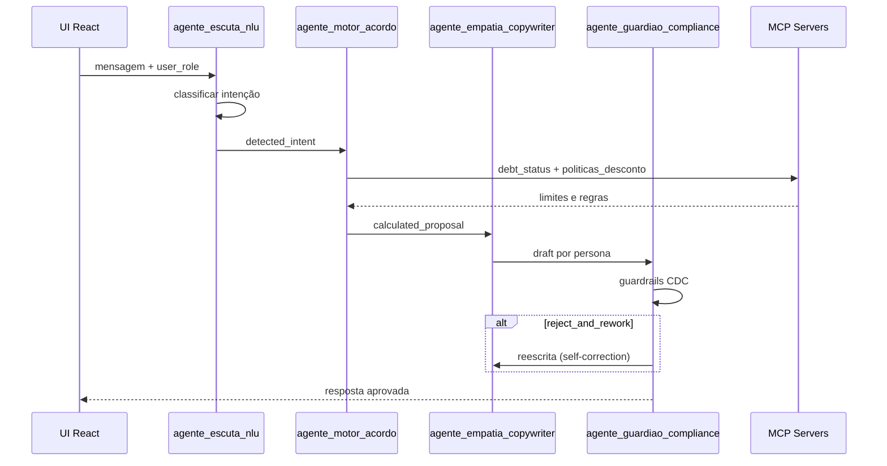

# Arquitetura — POC Multiagente de Cobrança

Este repositório contém o código-fonte completo (UI + orquestrador serverless) e as especificações arquiteturais para a orquestração de múltiplos agentes de IA no contexto de recuperação de crédito.

## Estrutura do Repositório

```
poc-collection-agents/
├── docs/          # Documentação (Arquitetura, PRD, Requisitos)
├── config/        # Harness YAML (System Prompts, Tools, MCPs)
├── src/           # Interface React (Vite)
├── public/        # Assets estáticos
└── index.html
```

## Visão Geral

```
┌──────────────────────────────────────────────────────────────────┐
│  Adapters (fase 2)                                                │
│  WhatsApp / CRM ➔ Schema Unificado de Mensagens                 │
├──────────────────────────────────────────────────────────────────┤
│  UI (React/Vite) — src/App.jsx                                    │
│  Chat dual-persona │ Inspetor IA │ Grafo │ Logs │ Cockpit        │
├──────────────────────────────────────────────────────────────────┤
│  Security Gate (Layer 0) — api/lib/security.js                    │
│  Token Flooding │ Prompt Injection │ Jailbreak │ Leakage Scan    │
├──────────────────────────────────────────────────────────────────┤
│  Orchestrator (Vercel Function) — api/orchestrate.js              │
│  Escuta NLU ➔ Motor Acordo ➔ Empatia ➔ Guardião Compliance     │
│  SSE streaming │ self-correction loop                             │
├──────────────────────────────────────────────────────────────────┤
│  Harness executável + MCP mocks + RAG                             │
│  config/harness_negotiator.yaml │ api/lib/tools.js                │
└──────────────────────────────────────────────────────────────────┘
```

## Camadas

### 1. Adapters

Converte mensagens do WhatsApp/CRM para o schema unificado. O parâmetro `user_role` (`CUSTOMER` | `AGENT`) guia o pipeline sem duplicar lógica.

**Estado atual:** mock local na UI.

### 2. Core (Orquestrador serverless)

Orquestrador in-house (sem framework) em `api/orchestrate.js`. 4 agentes definidos
no harness YAML, executados sequencialmente via OpenRouter:

| Agente | ID | Função | MCP / Tools |
|--------|-----|--------|-------------|
| Escuta Ativa | `agente_escuta_nlu` | Intent + sentimento (structured output) | — |
| Motor de Acordo | `agente_motor_acordo` | Cálculo da proposta | `get_debt_status`, `get_politicas_desconto`, `calculate_amortization` |
| Empatia | `agente_empatia_copywriter` | Copywriting por persona | — |
| Guardião | `agente_guardiao_compliance` | Compliance CDC (4 camadas) | `check_guardrail_violations`, `get_cdc_guidelines`, leakage scan |

Cada agente é um módulo isolado em `api/lib/agents/` retornando `{ patch, trace }`.
O loop Empatia → Guardião pode disparar self-correction até `max_attempts` vezes (config no YAML).

#### Model Profiles (framework agnóstico + tuning por modelo)

O modelo de cada agente NÃO está fixado no código. O YAML define **model profiles** — conjuntos coesos de (model, temperatura, estratégia JSON, hints de prompt, pricing) — e o orquestrador resolve via `resolveAgent(id)` em `api/lib/harness.js`.

| Profile | Quando usar | JSON strategy |
|---------|-------------|---------------|
| `gemini-flash-lite` (default) | Demos baratas, alta vazão | `json_object` + hint `gemini_flash` |
| `openai-blend` | Produção / qualidade máxima | `schema_strict` |
| `claude-haiku` | Anthropic budget tier | `json_object` + hint `claude_xml` |

Trocar de modelo é uma única env var:

```bash
OPENROUTER_MODEL_PROFILE=openai-blend npm run dev
```

A camada `api/lib/openrouter.js` mapeia a estratégia para o `response_format` adequado:

- `schema_strict` → `{type: 'json_schema', json_schema: {strict: true, schema}}` (OpenAI)
- `json_object` → `{type: 'json_object'}` (Gemini, Claude, Mistral via OpenRouter)
- `prompted_json` → sem `response_format` (prompt sugere JSON + `parseJSON` regex)
- `text` → resposta livre (Empatia)

E aplica `promptHints` (`gemini_flash`, `claude_xml`, …) para anexar um sufixo de contrato JSON ao system prompt quando o modelo subjacente se beneficia disso. Os prompts base no YAML permanecem 100% agnósticos.

#### Custo

`estimateCostUsd(resolvedAgent, usage)` calcula `prompt_tokens * input_per_1m / 1M + completion_tokens * output_per_1m / 1M` lendo o `pricing` do profile. Sem pricing, cai para um rate blended legado (`0.008/1K`).

**Estado atual:** pipeline real via OpenRouter + fallback simulado
no frontend cobrindo 100% das features quando não há chave configurada.

### 3. Harness e RAG

Arquivo `config/harness_negotiator.yaml` define:

- System prompts por agente
- MCP servers (URNs)
- Tools disponíveis
- Guardrails (`strict_regex_block` → `reject_and_rework`)
- Campos do state graph

### 4. Isolamento de Dados (MCP)

O LLM **nunca acessa BD diretamente**. Dados de dívida e políticas chegam via MCP:

- `urn:mcp:crm:debt_status` — saldo, atraso, limites
- `urn:mcp:vector-store:politicas_desconto` — tabelas de alçada
- `urn:mcp:vector-store:cdc_guidelines` — regras CDC

## State Graph

```json
{
  "session_id": "string",
  "user_role": "CUSTOMER | AGENT",
  "detected_intent": "string",
  "calculated_proposal": "object | null",
  "compliance_status": "APROVADO | REJEITADO | null"
}
```

### Fluxo



## Stack

| Camada | Tecnologia |
|--------|------------|
| UI | React 18, Vite 6, Tailwind 3, Lucide |
| Config (harness) | YAML (`harness_negotiator.yaml`), parsed via `js-yaml` |
| Orquestrador | Node.js puro em Vercel Functions, SSE streaming |
| LLM provider | OpenRouter (modelos sobrescrevíveis via YAML) |
| Segurança | `api/lib/security.js` — token flood / injection / jailbreak / leakage |
| Dados | Contrato MCP (mocks determinísticos em `api/lib/tools.js`) |
| Deploy | Vercel (region `gru1`, `maxDuration: 30s`) |

## Como testar localmente

```bash
cd poc-collection-agents
npm install
npm run dev
```

Abra a URL exibida pelo Vite (tipicamente `http://localhost:5173`).

Para demonstrar features com mensagens prontas, use o [Guia de prompts](prompt_guide.md).

## Deploy na Vercel

1. Faça push deste código para um repositório no GitHub.
2. Aceda ao dashboard da Vercel e clique em **Add New Project**.
3. Importe o repositório do GitHub.
4. Defina **Root Directory** como `poc-collection-agents` (se o repo for monorepo).
5. A Vercel detetará automaticamente Vite/React. Clique em **Deploy**.

## Próximos Passos

1. Substituir mocks MCP (`api/lib/tools.js`) por servers MCP reais (`debt_status`, `politicas_desconto`, `cdc_guidelines`)
2. Persistência de sessões (atualmente em `sessionStorage` do browser)
3. Adapters reais para WhatsApp Cloud API e Twilio
4. Runner automatizado de evals (`evals.scenarios`) com gate em CI
5. Migrar de orquestrador in-house para LangGraph quando houver mais ramos condicionais
